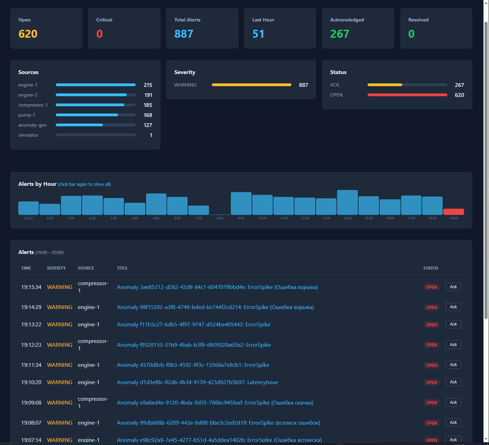
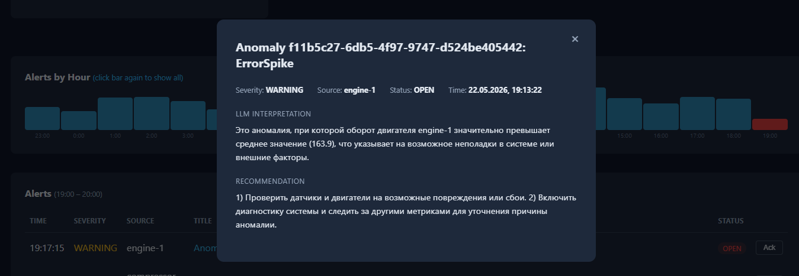

# SentinelFlow

Intelligent telemetry streaming analytics and anomaly detection platform.

```
Ingestion ──> Kafka ──> Flink (Processor + Detector) ──> Kafka ──> LLM Analyzer ──> Kafka ──> Dashboard
   ▲                                                                                             │
   │                                                                                             ▼
Simulator ─────────────────────────────────────────────────────────────> Storage (TimescaleDB) ◄─┘
```

## Architecture

### Modules

| Module | Port | Назначение |
|--------|------|------------|
| `sentinelflow-gateway` | 8080 | API Gateway (маршрутизация + rate limiter) |
| `sentinelflow-ingestion` | 8081 | Приём телеметрии (HTTP → Kafka) |
| `sentinelflow-simulator` | — | Генератор тестовых данных + аномалий |
| `sentinelflow-flink-jobs/processor` | — | Flink-джоб: обогащение сырых событий |
| `sentinelflow-flink-jobs/detector` | — | Flink-джоб: Z-score + rule-based детекция |
| `sentinelflow-storage` | 8086 | Хранение + TimescaleDB запросы |
| `sentinelflow-llm-analyzer` | 8084 | LLM-интерпретация аномалий (Ollama) |
| `sentinelflow-dashboard` | 8085 | Веб-интерфейс + WebSocket real-time |
| `sentinelflow-common` | — | Общие модели и конфигурация |

### Data Flow

1. **Simulator** читает CSV и генерирует аномалии → HTTP POST в Ingestion
2. **Ingestion** валидирует и публикует в Kafka (`raw-events`)
3. **Flink Processor** обогащает события (correlationId, цепочки сервисов) → `enriched-events`
4. **Flink Detector** анализирует enriched-события (Z-score) и raw-события (правила) → `anomaly-events`
5. **Storage** сохраняет все события в TimescaleDB (с partitioned hypertable)
6. **LLM Analyzer** отправляет аномалии в Ollama (qwen3:1.7b) → `llm-insights`
7. **Dashboard** получает LLM-интерпретации, сохраняет алерты в PostgreSQL, транслирует через WebSocket

## Скриншоты


*Dashboard: сводка, графики источников/severity/статусов, почасовой график, таблица алертов*


*Модальное окно с LLM-интерпретацией и рекомендациями*

## Технологический стек

| Компонент | Технология |
|-----------|-----------|
| Язык | Java 21 |
| Фреймворк | Spring Boot 3.5.x |
| Сборка | Maven (multi-module) |
| Потоковая обработка | Apache Flink 1.18 (DataStream API + CEP) |
| Брокер сообщений | Kafka (KRaft mode) |
| База данных метрик | TimescaleDB (PostgreSQL) |
| База данных алертов | PostgreSQL |
| LLM | Ollama (qwen3:1.7b, локально, CPU) |
| Контейнеризация | Docker Compose |
| UI | Vanilla JS SPA + WebSocket |

## Быстрый старт

```bash
# 1. Инфраструктура
docker compose up -d

# 2. Сервисы
docker compose -f docker-compose.srv.yaml up -d

# 3. Проверить Flink джобы
curl http://localhost:8081/jobs/overview

# 4. Dashboard
open http://localhost:8085
```

**Важно:** Docker CLI из Windows запускается через WSL:
```powershell
wsl.exe bash -c "cd /mnt/c/wrk/advantum/sentinelflow && docker compose ..."
```

## Конфигурация

### Ключевые переменные окружения

| Переменная | По умолчанию | Описание |
|-----------|-------------|----------|
| `KAFKA_BOOTSTRAP_SERVERS` | `localhost:9092` | Kafka bootstrap (host) / `kafka:9094` (Docker) |
| `OLLAMA_MODEL` | `qwen3:1.7b` | Модель для LLM-анализа |
| `LLM_LANGUAGE` | `ru` | Язык ответа LLM (ru/en/de/fr/es/it/pt/zh/ja/ko) |
| `DB_HOST` | `localhost` | Хост PostgreSQL |
| `DB_PASSWORD` | `password` | Пароль PostgreSQL |
| `SIMULATOR_AUTO_START` | `false` | Автостарт симулятора |
| `SIMULATOR_ANOMALY_ENABLED` | `false` | Генерация аномалий |
| `SIMULATOR_ANOMALY_CONTINUOUS` | `false` | Бесконечная генерация |

## Docker Compose

- `docker-compose.yaml` — инфраструктура: Kafka (KRaft), TimescaleDB, PostgreSQL, Flink, Ollama
- `docker-compose.srv.yaml` — сервисы: gateway, ingestion, storage, llm-analyzer, dashboard, simulator, flink-submit

## Flink Jobs

### Processor Job
- Потребляет: `raw-events`
- Публикует: `enriched-events`
- Логика: обогащение контекстом (correlationId, цепочки сервисов)

### Detector Job
- Потребляет: `enriched-events` (StatisticalDetector, Z-score) + `raw-events` (RuleEngineFunction)
- Публикует: `anomaly-events`
- Логика: скользящее окно 10 элементов, Z-score > 2.5 → аномалия + правила (status=ERROR, durationMs>1000)

Перезапуск Flink джоба:
```bash
curl -X PATCH "http://flink-jobmanager:8081/jobs/{jid}?mode=cancel"
docker exec flink-submit flink run -d -m flink-jobmanager:8081 /jobs/sentinelflow-detector.jar kafka:9094
```

## Kafka Topics

| Топик | Тип | Производитель | Потребители |
|-------|-----|--------------|-------------|
| `raw-events` | TelemetryEvent | ingestion | storage, flink-processor, flink-detector |
| `enriched-events` | EnrichedTelemetryEvent | flink-processor | flink-detector |
| `anomaly-events` | AnomalyEvent | flink-detector | llm-analyzer |
| `llm-insights` | LlmInsight | llm-analyzer | dashboard |
| `alerts` | Alert | dashboard | — |

## Разработка

```bash
# Сборка всех модулей (кроме Flink)
mvn clean package -DskipTests

# Сборка Flink JARs (Java 17 target)
mvn clean package -DskipTests -Dmaven.compiler.release=17 \
  -pl sentinelflow-flink-jobs/processor,sentinelflow-flink-jobs/detector

# Тесты
mvn test
```
